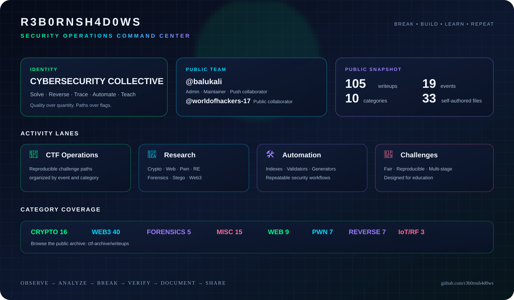

<div align="center">




# R3B0RNSH4D0WS

## BREAK • BUILD • LEARN • REPEAT

**Cybersecurity collective • CTF operations • security research • open knowledge**

[](https://github.com/r3b0rnsh4d0ws)
[](https://github.com/r3b0rnsh4d0ws/ctf-archive/tree/main/writeups)
[](https://github.com/r3b0rnsh4d0ws/ctf-archive/tree/main/writeups)
[](https://github.com/r3b0rnsh4d0ws/ctf-archive/tree/main/writeups)

</div>

<p align="center">
  <a href="#team"></a>
  <a href="#what-we-publish"></a>
  <a href="#ctf-archive"></a>
  <a href="#self-authored"></a>
  <a href="#contributing"></a>
</p>

---

<a id="team"></a>

## 👥 The team

<div align="center">

| 🧠 Identity | 🛠️ Practice | 🚀 Mission |
|:---:|:---:|:---:|
| We are **R3B0RNSH4D0WS**. | We solve, reverse, trace, automate, and teach. | We turn hard-earned paths into public knowledge. |

</div>

R3B0RNSH4D0WS is a practical cybersecurity collective focused on CTF solving, reverse engineering, attack research, forensic analysis, tooling, and original challenge design.

```text
observe → analyze → break → verify → document → share
```

> **Our rule:** the flag is only the beginning. The real deliverable is the reasoning, the reproducible path, and the lesson.

### Public team view

GitHub currently exposes the following public repository collaborators. We do not publish private membership data or invent biographies and roles that are not publicly verifiable.

| Member | Public role visible on GitHub | Contribution surface |
|---|---|---|
| [@balukali](https://github.com/balukali) | Repository admin · maintainer · push collaborator | Archive stewardship, publication, repository access, and project direction |
| [@worldofhackers-17](https://github.com/worldofhackers-17) | Repository collaborator | Public collaboration on the organization’s security work |

> The organization currently reports no public members in its public overview. This is a transparent **public collaborator view**, not a private roster.

<details>
<summary><strong>How we define the team</strong></summary>

The public team is built around contribution and accountable work, not invented titles. The profile shows only relationships that GitHub publicly exposes. Private membership, personal biographies, and unpublished roles stay private unless explicitly approved for publication.

</details>

---

<a id="what-we-publish"></a>

## 🧩 What we publish

<div align="center">

| 🏁 CTF Archive | 🧪 Research & Writeups | 🛠️ Tools & Automation | 🧩 Original Challenges |
|:---:|:---:|:---:|:---:|
| Reproducible challenge paths organized by event and category. | Crypto, web, pwn, reverse, forensics, stego, OSINT, IoT/RF, and Web3 notes. | Validators, indexes, generators, solvers, and repeatable workflows. | Fair single-category and multi-stage challenges designed for education. |

</div>

<details open>
<summary><strong>Current public snapshot</strong></summary>

| Metric | Count | Description |
|---|---:|---|
| Selected writeups | **105** | Deduplicated, public-safe CTF writeups |
| CTF events | **19** | Events represented in the curated archive |
| Technical categories | **10** | Browseable collections |
| Self-authored files | **33** | Current public source/documentation files |
| Raw third-party artifacts | **0** | Deliberately excluded |
| Public archive size | **~694 KB** | Lightweight and GitHub-friendly |

</details>

<details>
<summary><strong>Research areas</strong></summary>

- **Cryptography:** RSA, AES, classical ciphers, LFSR/PRNG recovery, hashing, oracles, padding, lattice notes, and key-recovery patterns.
- **Web security:** injection, authentication, deserialization, request attacks, application logic, and multi-stage exploitation.
- **Pwn:** stack and heap corruption, format strings, ROP, binary constraints, and exploit reliability.
- **Reverse engineering:** binaries, VMs, anti-debugging, obfuscation, embedded systems, and protocol reconstruction.
- **Forensics:** PCAPs, memory and disk artifacts, logs, OSINT evidence, cross-artifact correlation, and satellite/RF data.
- **Steganography and misc:** image/audio hiding, encodings, esolangs, constraints, game logic, and unusual formats.
- **Web3:** fund-flow tracing, token accounting, contract behavior, DeFi, RPC verification, and cross-chain investigations.
- **Challenge authoring:** original single-category, multi-stage, and cross-category challenge systems.

</details>


---

<a id="ctf-archive"></a>

## 🏁 CTF archive dashboard

The archive is the team’s main public knowledge surface. Every writeup follows the same navigable shape:

```text
CTF → Category → Writeup → Technique → Lesson
```

<div align="center">

[](https://github.com/r3b0rnsh4d0ws/ctf-archive/tree/main/writeups/README.md)
[](https://github.com/r3b0rnsh4d0ws/ctf-archive/tree/main/writeups/Crypto.md)
[](https://github.com/r3b0rnsh4d0ws/ctf-archive/tree/main/writeups/Web3.md)
[](https://github.com/r3b0rnsh4d0ws/ctf-archive/tree/main/writeups/Forensics.md)
[](https://github.com/r3b0rnsh4d0ws/ctf-archive/tree/main/writeups/Pwn.md)
[](https://github.com/r3b0rnsh4d0ws/ctf-archive/tree/main/writeups/Reverse.md)

</div>

### Featured events

<details open>
<summary><strong>SCAN 2026 — Web3 investigation lab</strong></summary>

The largest public collection: **40 Web3 writeups** covering fund-flow tracing, token accounting, contract deployment, setter behavior, DEX interactions, exchange withdrawals, laundering paths, and cross-chain cases.

[Open the SCAN Web3 collection →](https://github.com/r3b0rnsh4d0ws/ctf-archive/tree/main/writeups/SCAN-2026/Web3/)

</details>

<details>
<summary><strong>L3akCTF 2026 — crypto, forensics, pwn, and web</strong></summary>

PRNG recovery, RSA/MQ notes, CT reconstruction, Bosh and VM/reverse paths, and modern web attack chains.

[Open L3akCTF →](https://github.com/r3b0rnsh4d0ws/ctf-archive/tree/main/writeups/L3akCTF-2026/)

</details>

<details>
<summary><strong>StarPwn 2026 — space, RF, forensics, and stego</strong></summary>

PCAP/RF analysis, satellite and orbital concepts, memory/artifact forensics, image steganography, web/space operations, and multi-stage challenge paths.

[Open StarPwn →](https://github.com/r3b0rnsh4d0ws/ctf-archive/tree/main/writeups/StarPwn-2026/)

</details>

<details>
<summary><strong>K17, BushBash, Nexploit, and PwnSec</strong></summary>

Shamir secret spilling, format strings, ECB/CBC manipulation, vault paths, classical ciphers, LFSR challenges, code-generation injection, and reverse engineering.

[Open the complete index →](https://github.com/r3b0rnsh4d0ws/ctf-archive/tree/main/writeups/README.md)

</details>

### Browse by category

| Category | Count | What you will find |
|---|---:|---|
| [Crypto](https://github.com/r3b0rnsh4d0ws/ctf-archive/blob/main/writeups/Crypto.md) | 16 | RSA, AES, CBC/ECB, LFSR, PRNGs, classical ciphers, hash and lattice notes |
| [Web3](https://github.com/r3b0rnsh4d0ws/ctf-archive/blob/main/writeups/Web3.md) | 40 | Blockchain tracing, DeFi, token flows, RPC verification, and laundering analysis |
| [Forensics](https://github.com/r3b0rnsh4d0ws/ctf-archive/blob/main/writeups/Forensics.md) | 5 | PCAPs, memory/artifact analysis, satellite and cross-artifact reasoning |
| [Misc](https://github.com/r3b0rnsh4d0ws/ctf-archive/blob/main/writeups/Misc.md) | 15 | Encoding chains, pyjails, esolangs, constraints, and game logic |
| [Web](https://github.com/r3b0rnsh4d0ws/ctf-archive/blob/main/writeups/Web.md) | 9 | Injection, deserialization, authentication, request and application attacks |
| [Pwn](https://github.com/r3b0rnsh4d0ws/ctf-archive/blob/main/writeups/Pwn.md) | 7 | Buffer overflows, format strings, ROP, heap, and exploit primitives |
| [Reverse](https://github.com/r3b0rnsh4d0ws/ctf-archive/blob/main/writeups/Reverse.md) | 7 | VMs, anti-debug, deobfuscation, custom encodings, and binary analysis |
| [IoT / RF](https://github.com/r3b0rnsh4d0ws/ctf-archive/blob/main/writeups/IoT.md) | 3 | Firmware, radio, satellite, and embedded-system paths |
| [Steganography](https://github.com/r3b0rnsh4d0ws/ctf-archive/blob/main/writeups/Steganography.md) | 2 | LSB, image, audio, and hidden-data techniques |
| [OSINT](https://github.com/r3b0rnsh4d0ws/ctf-archive/blob/main/writeups/OSINT.md) | 1 | Identity, infrastructure, and investigation patterns |

---

<a id="self-authored"></a>

## 🧩 Self-authored challenge lab

We create original challenges for CTF deployment and education.

<div align="center">

[](https://github.com/r3b0rnsh4d0ws/ctf-archive/tree/main/self-authored)

</div>

<details open>
<summary><strong>General Skills collection</strong></summary>

- `git_blunder` — recover a flag from commit history.
- `rabbit_hole_readme` — follow a documented transformation chain.
- `whitespace_secrets` — decode SPACE/TAB bit encoding.
- `recursive_base64` — decode a deep base64 chain.
- `tiny_text_svg` — inspect tiny SVG text and ROT13.
- `obfuscated_script` — reconstruct a flag at runtime.
- `needle_in_haystack` — filter a large log and decode the result.
- `the_fine_print` — follow cross-references through a long document.

</details>

<details>
<summary><strong>Multi-stage original work</strong></summary>

- [Arachne Web](https://github.com/r3b0rnsh4d0ws/ctf-archive/tree/main/self-authored/web/arachne-web) — crypto, reverse, web, forensics, and pwn chained into one challenge.
- [Reverse challenge](https://github.com/r3b0rnsh4d0ws/ctf-archive/tree/main/self-authored/revchallenge) — reverse the score gate instead of dumping the flag.

</details>

> Challenge-design principles: one intended path, fair inputs, meaningful anti-shortcuts, reproducible generation, and a clear separation between player files, private flags, and author solutions.


---

<a id="workflow"></a>

## 🧭 How we work

<div align="center">

| 01 Understand | 02 Search | 03 Triage | 04 Verify |
|:---:|:---:|:---:|:---:|
| Read the artifact and constraints. | Reuse prior knowledge. | Test fast and reversible ideas. | Confirm the result reproducibly. |

| 05 Document | 06 Share | 07 Protect | 08 Improve |
|:---:|:---:|:---:|:---:|
| Capture insight and commands. | Publish the useful lesson. | Keep secrets and live systems private. | Make the next path easier. |

</div>

### Operating principles

- **Quality over quantity.**
- **Document the path, not just the flag.**
- **Preserve failed approaches when they are educational.**
- **Prefer reproducible evidence over unsupported claims.**
- **Respect redistribution rights.**
- **Keep secrets and live infrastructure private.**
- **Make the next learner’s path easier than our own.**

---

<a id="contributing"></a>

## 🤝 Contribute

Want to add a verified writeup, research note, tool, or challenge?

1. Solve and verify the challenge.
2. Write a reproducible writeup with the key insight, commands, and lessons.
3. Check for private tokens, cookies, infrastructure, and redistribution issues.
4. Open a pull request against [`r3b0rnsh4d0ws/ctf-archive`](https://github.com/r3b0rnsh4d0ws/ctf-archive).

<details>
<summary><strong>Contribution quality gate</strong></summary>

- Is the result verified?
- Is the path understandable to another learner?
- Are commands and reasoning reproducible?
- Are failed approaches useful and safe to share?
- Are private tokens, cookies, infrastructure, and unreleased material excluded?
- Are redistribution rights clear for every included artifact?

</details>

<div align="center">

[](https://github.com/r3b0rnsh4d0ws/ctf-archive/tree/main/writeups/README.md)
[](https://github.com/r3b0rnsh4d0ws)
[](https://github.com/r3b0rnsh4d0ws/ctf-archive)

</div>

---

<div align="center">

## BREAK • BUILD • LEARN • REPEAT

**R3B0RNSH4D0WS — practical security work, shared openly.**

</div>

